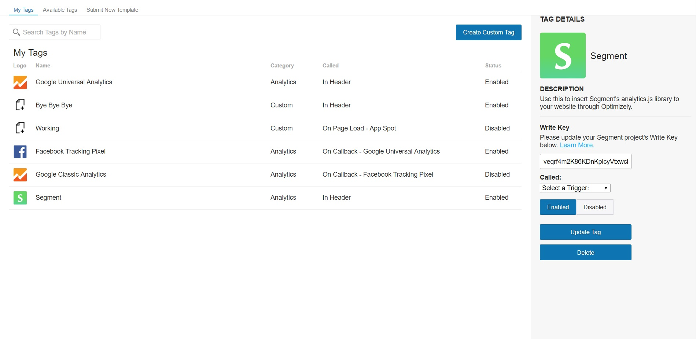
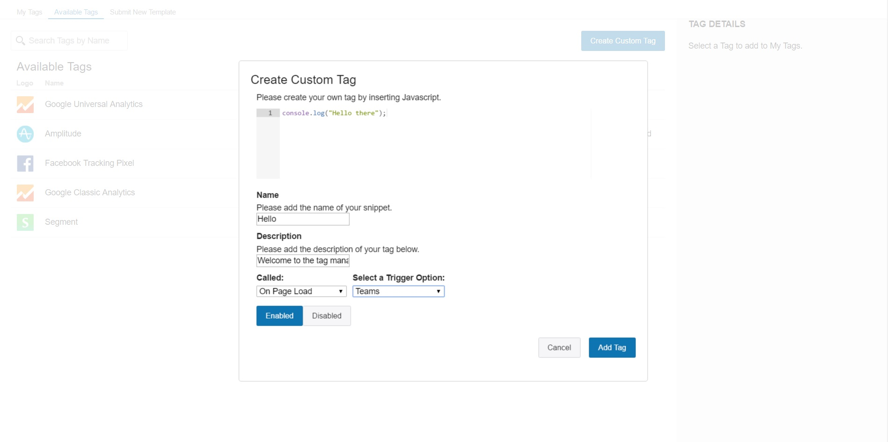

# Optimizely Tag Manager
Tag Manager empowers non-technical marketers to add third-party Javascript tags (i.e. Google Analytics) to their websites with zero lines of code.

Technical Overview: This tag manager is written using React.js and Node.Js. Client cod ecan be found in the folder `client/`. MongoDB schema is in the folder `models/`.

Features:
  * Dynamically add, update, and delete third-party Javascript tags to an Optimizely project with zero lines of code.
  * Allows for the creation of custom Javascript tags to be inserted, as well as a form to submit new templates to be added to the platform.
  * Allows tags to be loaded in the header of a website, on document ready, on the callback of trigger, or on a specific page or event specified within the Optimizely project.
